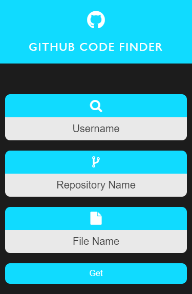
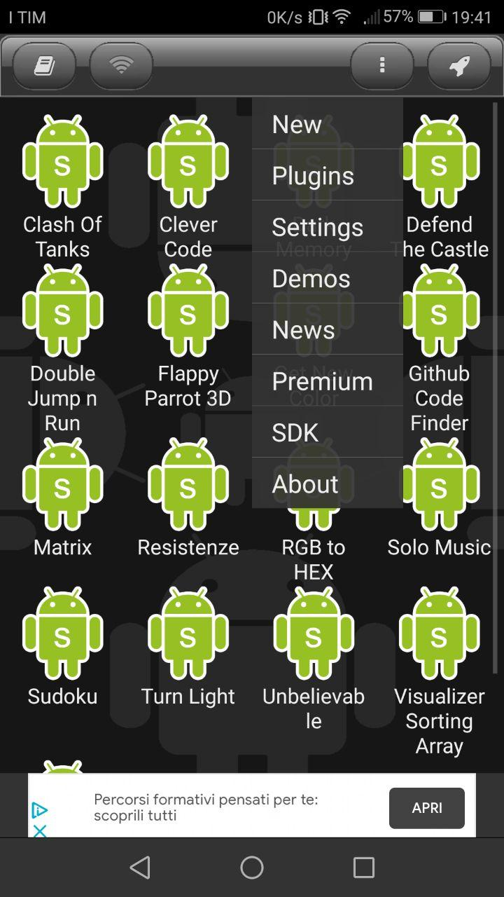
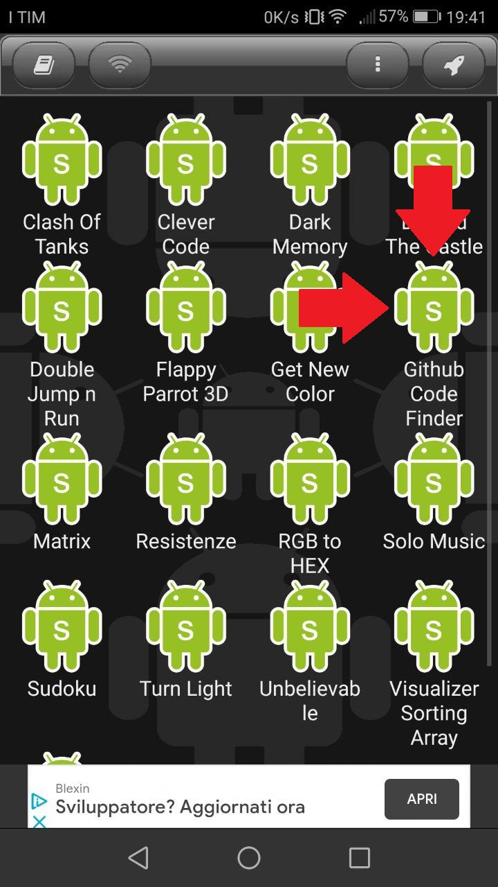
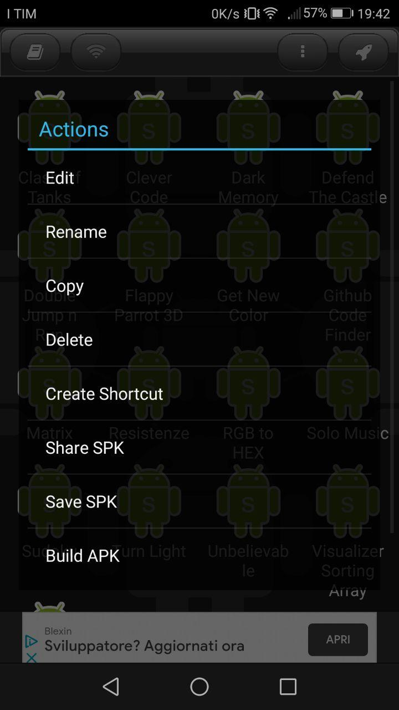

# Github Code Finder
L'applicazione _Github Code Finder_ ti permetterà di accedere a qualsiasi file di Github inserendo il nome utente, il nome o il percorso della repository e il nome del file che si vuole aprire! Niente di più facile e veloce!

<p align="center">
 
</p>

Esempio di utilizzo:
1) Username: _AntonioBerna_
2) Repository Name: _Github-Code-Finder/Github Code Finder/js_
3) File Name: _script.js_

Dopo aver premuto sul bottone _Get_ viene visualizzato il contenuto del file:

```
$('form').on('submit', (e) => {
	e.preventDefault();

	let username = $('#username').val();
	let repository = $('#repository').val();
	let filename = $('#filename').val();

	if(username && repository && filename){
		$('.filename, .text-editor').slideDown();
		axios
			.get(`https://cdn.jsdelivr.net/gh/${username}/${repository}/${filename}`)
			.then((res) => {
				$('.text-editor pre').text(res.data);
				$('.filename').text(filename);
				$('#filename').val('');
			})
			.catch((err) => $('.text-editor pre').text('Not Found'));
	}
});

$('.filename, .text-editor').hide();
```

# Utilizzare l'applicazione su Android (IOS in arrivo...)

Per utilizzare l'applicazione _Github Code Finder_ sul nostro smartphone Android è sufficiente scaricare dal Play Store [DroidScript](https://play.google.com/store/apps/details?id=com.smartphoneremote.androidscriptfree&hl=en_GB&showAllReviews=true)!

Una volta conclusa l'installazione, apriamo **DroidScript** e **clicchiamo sui tre puntini in alto a destra** e poi nuovamente su **'New'**:

<p align="center">
    
</p>

Quindi, si aprirà una schermata simile a questa:

<p align="center">
    
</p>

Ora dobbiamo sostituire la scritta **'Native'** con la scritta **'HTML'** (cliccandoci sopra) e dobbiamo inserire il **nome della nostra applicazione**:

<p align="center">
    
</p>

e infine clicchiamo su **'OK'**. Ora teniamo premuto il dito sull'icona dell'applicazione:

<p align="center">
    
</p>

Quindi, si aprirà una schermata simile a questa:

<p align="center">
    
</p>

Ora cliccando su **Edit**, dobbiamo inserire il codice nel singolo file di testo che si aprirà, che nel mio caso è il seguente:

```
<!DOCTYPE html>
<html>
<head>
 <meta charset="UTF-8"/>
 <title>Github Code Finder</title>

 <!-- CSS Links -->
 <link rel="stylesheet" type="text/css" href="https://stackpath.bootstrapcdn.com/font-awesome/4.7.0/css/font-awesome.min.css"/>
 <meta name="viewport" content="width=devide-width, initial-scale=1.0"/>

 <!-- Javascript Links -->
 <script src="https://ajax.googleapis.com/ajax/libs/jquery/3.5.1/jquery.min.js"></script>
 <script src="https://cdnjs.cloudflare.com/ajax/libs/axios/0.19.2/axios.min.js"></script>
 
 <style type="text/css">
    *{
     margin: 0;
     padding: 0;
     box-sizing: border-box;
    }
    
    body{
     background-color: #1c1c1c;
     font-family: 'Gill Sans', 'Gill Sans MT', Calibri, 'Trebuchet MS', sans-serif;
    }
    
    header{
     background-color: rgb(16, 219, 255);
     display: flex;
     padding: 10px;
     justify-content: center;
     color: #fff;
     align-items: center;
    }
    
    header h1{
     font-size: 25px;
     text-transform: uppercase;
     letter-spacing: 2px;
     font-weight: 400;
    }
    
    header .github, header h1{
     margin: 0 10px;
    }
    
    header .github{
     font-size: 40px;
    }
    
    form{
     color: #fff;
     display: flex;
     justify-content: center;
     align-items: center;
     flex-direction: column;
     padding: 40px;
    }
    
    form div, .get-btn{
     background-color: rgb(16, 219, 255);
     color: #fff;
     margin: 10px;
     justify-content: space-evenly;
     align-items: center;
     display: flex;
     height: 40px;
     width: 400px;
     border-radius: 10px;
    }
    
    form div input{
     height: 100%;
     font-size: 20px;
     padding: 10px;
     background-color: rgb(233, 233, 233);
     width: 350px;
     border-radius: 0 10px 10px 0;
    }
    
    form div input::placeholder{
     color: rgb(59, 59, 59);
    }
    
    form div span{
     text-align: center;
     width: 50px;
    }
    
    .get-btn{
     font-size: 16px;
    }
    
    input, button{
     outline: none;
     border: none;
    }
    
    button, input[type="submit"]{
     cursor: pointer;
    }
    
    .text-editor{
     color: #fff;
     background-color: #1c1c1c;
     font-size: 20px;
     border-bottom: 3px solid rgb(16, 219, 255);
     line-height: 1.5;
     width: 95%;
     border-radius: 10px;
     margin: auto;
     padding: 20px;
     font-family: monospace;
     overflow-x: auto;
     word-wrap: break-word;
    }
    
    .filename{
     background-color: rgb(16, 219, 255);
     width: 95%;
     text-align: center;
     padding: 10px;
     font-size: 20px;
     color: #fff;
     border-radius: 10px 10px 0 0;
     position: relative;
     top: 5px;
     margin: auto;
    }
    
    @media (max-width: 550px){
     .form, .form div, .form input, .form button{
      width: 100%;
     }
    
     .form{
      padding: 40px 10px;
     }
    
     header h1{
      font-size: 22px;
     }
    
     .text-editor{
      font-size: 18px;
     }
    
     header{
      flex-direction: column;
     }
    
     header h1, header span{
      padding: 10px 0;
     }
    
     .form div{
      margin: 20px;
      height: 70px;
      flex-direction: column;
     }
    
     .form span{
      position: relative;
      top: 10px;
      font-size: 25px;
      border-radius: 10px 10px 0 0;
     }
    
     .form input{
      position: relative;
      text-align: center;
      top: 20px;
      border-radius: 0 0 10px 10px;
     }
    
     .get-btn{
      margin: 20px;
     }
    }
 </style>
</head>
<body>
 <header>
  <span class="fa fa-github github"></span>
  <h1>Github Code Finder</h1>
 </header>
 <form class="form">
  <div>
   <span class="fa fa-search"></span>
   <input type="text" placeholder="Username" id="username">
  </div>
  <div>
   <span class="fa fa-code-fork"></span>
   <input type="text" placeholder="Repository Name" id="repository">
  </div>
  <div>
   <span class="fa fa-file"></span>
   <input type="text" placeholder="File Name" id="filename"></input>
  </div>
  <button class="get-btn">Get</button>
 </form>
 <div class="filename"></div>
 <div class="text-editor"><pre></pre></div>
 <script type="text/javascript">
 $('form').on('submit', (e) => {
     e.preventDefault();
    
     let username = $('#username').val();
     let repository = $('#repository').val();
     let filename = $('#filename').val();
    
     if(username && repository && filename){
      $('.filename, .text-editor').slideDown();
      axios.get(https://cdn.jsdelivr.net/gh/${username}/${repository}/${filename})
          .then((res) => {
        $('.text-editor pre').text(res.data);
        $('.filename').text(filename);
        $('#filename').val('');
       })
       .catch((err) => $('.text-editor pre').text('Not Found'));
     }
    });
    $('.filename, .text-editor').hide();
 </script>
</body>
</html>
```
Infine possiamo tornare alla homepage di **DroidScript** e cliccando sull'icona di _Github Code Finder_ si aprirà la nostra applicazione:
<p align="center">
    
</p>


# Per maggiori informazioni

Github Code Finder Application [Youtube]: **IN ARRIVO?!**

Created By Antonio Bernardini Copyright© 2021
